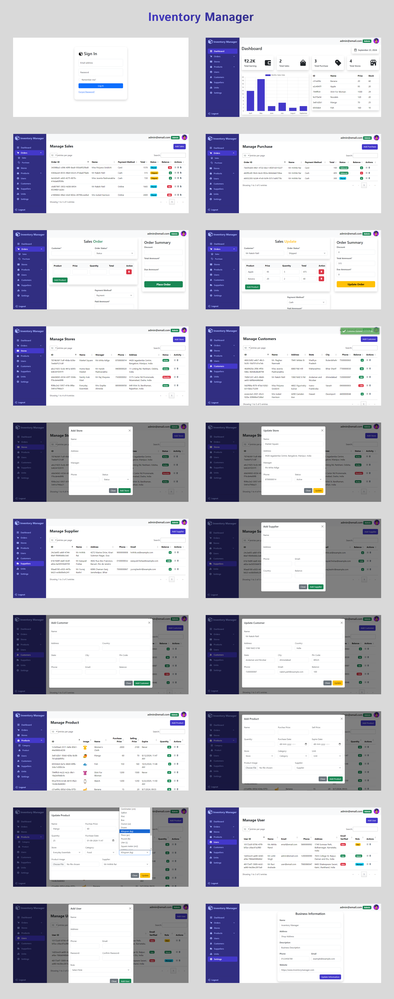
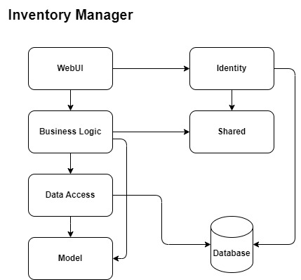
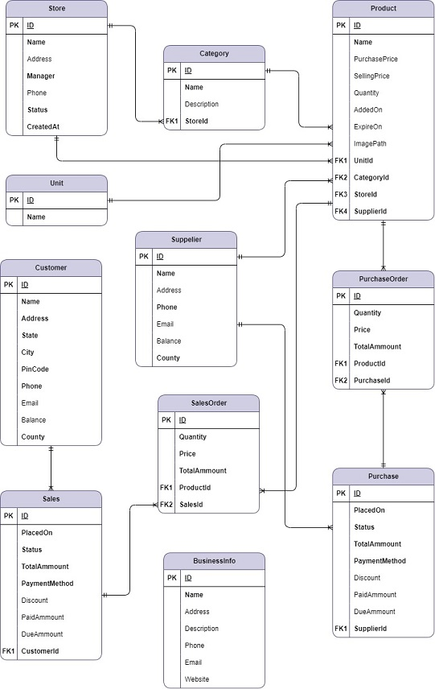

# Inventory Manager 📦

Inventory Manager is a user-friendly, modern, multi-store inventory management solution built on the `.NET` framework.

## Screenshots 📷

## Index 🧾

* [Feature](#features-)
* [Entities](#entities-)
* [Architecheral Desing](#architectural-design-)
* [Database Design](#database-design-)
* [Libraries](#libraries-)
  - [Backend](#backend-)
  - [Frontend](#frontend-)
* [Techniques](#techniques-)

## Features ✨

1. Interactive Dashboard
2. Multi-Store Management
    - Users can easily add, update, and remove multiple stores.
3. Multiple Product Categories
3. Product Management
    - Users can easily add, update, and remove product details, including images, expiration dates, prices, and more.
4. Orders Management
    - Sales Order
        - Users can easily add, update, and delete sales orders, including multiple products.
    - Purchase Order
        - Users can easily add, update, and delete purchase orders, including multiple products.
    - Auto-suggestion and autofill
        - The application offers suggestion and autofill features for customers, suppliers, and products, including details like unit price, product name, and availability.
        - For the purchase order, it displays product information only for the specified supplier.
5. Invoice Generation
    - Automatically generate a `PDF` invoice upon the successful completion of a sales order.
6. Unit Management
    - Users can add, update, or remove product units.
    - The application comes with a wide range of default units to choose from.
7. Customer Management
    - Easily add, remove, and update customer information.
    - Tracking customer account balance.
9. Supplier Management
    - Easily add, remove, and update supplier information.
    - Tracking supplier account balance.
10. Authentication and Role Based Authorization
    - A user with `Admin` and `Manager` authorization can create, read, update and delete user information.
11. Settings Configuration
    - `Users` with `Admin` privileges can configure `Business Information` such as. Store name, address, e-mail, phone number, website and more.

## Entities 👩‍👩‍👦‍👦

1. Store
2. Category
3. Products
4. Sales
5. Purchase
6. SalesOrder
7. PurchaseOrder
8. Customer
9. Supplier
10. Unit
11. BusinessInfo

## Architectural Design 🛠

## Database Design 🧱

## Libraries 🚀

### Backend 💻
- [FluentValidation](https://www.nuget.org/packages/fluentvalidation/)
- [Identity](https://learn.microsoft.com/en-us/aspnet/core/security/authentication/identity)
- [AutoMapper](https://automapper.org/)
- [DependencyInjection](https://www.nuget.org/packages/Microsoft.Extensions.DependencyInjection/)
- [Entit Fremwork Core](https://learn.microsoft.com/en-us/ef/core/)
- [PDFsharp](https://www.nuget.org/packages/PDFsharp)

### Frontend 💅
- [JQuery](https://jquery.com/)
- [DataTables](https://datatables.net/)
- [JQueryUi](https://jqueryui.com/)
- [Bootstrap](https://getbootstrap.com/)
- [Boxicons](https://boxicons.com/)
- [Validate](https://jqueryvalidation.org/)
- [Chart.js](https://www.chartjs.org/)
- [toastr](https://codeseven.github.io/toastr/demo.html/)

## Techniques 🔧

> * N-Layer Architecture
> * Repository Pattern
> * Generic repository alogn with spesific reposittory
> * UnitOfWork
> * Generic Services
> * Custom Validations using `FluentValidation`
> * Dependency Injection
> * AJAX
> * MVC
